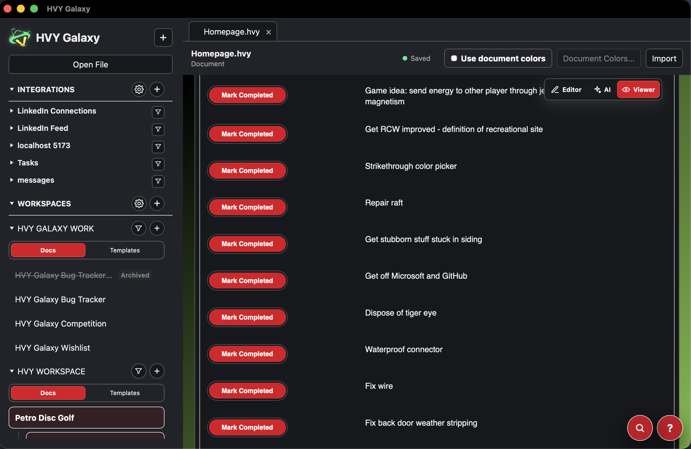

# HVY Galaxy

This is the repository for the HVY Galaxy Mac and Windows client.

HVY Galaxy is a multipurpose productivity desktop application. It is currently in alpha.

## Disclaimer
HVY Galaxy is an alpha product. The software is provided "as is", use at your own risk,
and Heavy Resume, Inc. is not responsible for damages caused by the use of this product.

## Core Features
- Create and manipulate HVY documents with revision tracking
- One click installation of MCP for Claude Desktop or ChatGPT (formally Codex)
- Highly configurable AI settings with support for local LLMs
- Workspaces and folders with ability to encrypt and manage keys at high granularity
- Integrate with web pages by picking examples to pull data from, or using Atom feeds or WebMCP

## Download
Get the latest released version at: [Heavy Resume](https://heavyresume.com/hvy-galaxy)

## Build Options
HVY Galaxy has builds for both Windows and Mac, using Electron and Tauri. 
Electron is much larger and slower but has higher compatibility. 
Tauri is faster and is a much smaller file size. On older Mac OS systems you may have
to use Electron.

## Current State
Everything related to the HVY file format is currently in alpha.

The repo itself is not yet set up for major contributions, with no CI configured and no
usage of GitHub's Releases.

- Many features are immature, especially around web integrations, encryption, plugins, etc. Take heed.
- If you have a really important file I would make a copy of it from time to time, just
in case.
- Web integrations currently have really rough edges. There is a risk of actions occuring on the wrong item. Treat web integrations like a toy.
- MCP is lightly tested and likely needs work to ensure the AI agent using it fully understands what it is doing.

A lot of functionality is immature, not well tested, and its not uncommon for surprising bugs or regressions
to be encountered. The good news is that alpha 5 has this happen a lot less than before for
common use cases.

# Development Information
Development is typically done in VS Code with `heavy-file-format` living in `../heavy-file-format`. This is not ideal but it is currently how it is done for convenience.

You will need to separately download and install the dependencies (this is a VS Code task so just use that).

## AI Contributions
AI cannot be trusted to properly test things, especially if it's UX / UI related. This repo
was written 99+% by AI (mostly GPT 5.5 and 5.6 Sol) so AI contributions are welcome, but only have it fix issues that you,
as a human, can reproduce and verify. Automated tested crafted by the AI frequently misses things.
It's better to start bug fixes with an isolated reproduction that can be confirmed. In some cases,
AI will think it reproduced the issue when it did not (i.e. I see X which would explain you seeing Y. I removed X. Fixed.)

## Common Issues
- The Tauri output file size is tiny. For some reason building Tauri takes up gigs 
  and gigs of space and those files get left until you explicitly purge them. 
  Just so you know...
- If you see a visual issue in a HVY document, check that it reproduces in the 
  reference implementation. If not, its either an issue with specifically how HVY 
  Galaxy is using the embed, or its an issue that HVY Galaxy created. For 
  example, setting a CSS rule that overrides whats in heavy-file-format.
- If you ask AI to fix an issue and it needs updates from heavy-file-format, be weary
  about it attempting to munge concerns between the two repos. The heavy-file-format
  repo is only concerned about mounting HVY documents and editing / viewing HVY. It
  should expose things necessary to accomplish things but not implement HVY Galaxy
  features.
- Some issues only show up in Tauri. If you're on a mac and see an issue that's not
  reproducing in Electron or heavy-file-format's reference implementation, double
  check against Safari.
  